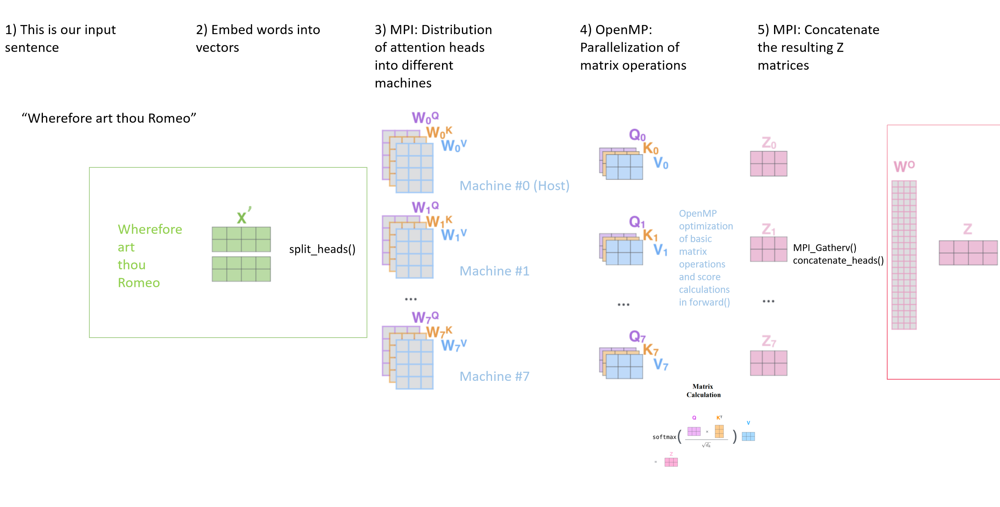

# 🚀 DistributedAttention

**DistributedAttention** is a high-performance Transformer model implemented from scratch, optimized with various parallel computing techniques including OpenMP, MPI, and CUDA.

## 📌 Project Status 
- ✅ **Baseline Transformer & Profiling** - Completed
- ✅ **OpenMP Optimization** - In Progress
- ⏳ **MPI Optimization** - In Progress
- ⏳ **CUDA Optimization** - In Progress

---
## ✨ Features

🔹 **Baseline Transformer**: Implements a standard Transformer model from scratch.<br>
🔹 **OpenMP Optimization**: Parallelizes computations using OpenMP. ⚡<br>
🔹 **MPI Optimization**: Distributes computation across multiple nodes with MPI. 🌍<br>
🔹 **CUDA Optimization**: Speeds up computations using GPU acceleration. 🎮<br>

---
## 📖 Overview
This project provides a highly optimized implementation of **Multi-Head Self-Attention (MHA)**, a key component of Transformer models, for **GPU architectures**. Using CUDA, the project explores and evaluates two parallelization strategies:
- **Horizontal parallelization** using native C++ threads.
- **Vertical parallelization** using CUDA streams and events.

The goal is to **achieve substantial speedups** for Transformer workloads, which are widely used in **Natural Language Processing (NLP) and Computer Vision (CV) tasks**.

---
## 📚 Background
Transformer models and their multi-head attention mechanisms have revolutionized NLP and beyond. However, their **computational demands are significant**.

This project focuses on **Multi-Head Self-Attention** and explores how different **parallelization strategies affect performance**. We compare three approaches:
1. **Baseline CPU Implementation**: A naive, single-threaded C++ version for reference.
2. **MPI + OpenMP Parallelization**:
   - **MPI** distributes workloads across compute nodes.
   - **OpenMP** parallelizes computations within each node.
3. **CUDA Acceleration**:
   - Implements key operations on GPUs.
   - Uses **CUDA streams** to parallelize computations across multiple heads.

By comparing these approaches, this project highlights **trade-offs in complexity, scalability, and speedup** for different optimization strategies.

---



---
## 🛠 Implementation Details
A single head attention kernel can be described as:

$$
Softmax\left(\frac{Q \times K^T}{\sqrt{d_k}}\right) \times V
$$

The Multi Head Attention Kernel includes three core operations:

- General Matrix Multiplication (GEMM)
- Softmax
- Transpose

The core of a multi head attention kernel is the single head attention kernel. The chronological order of a single head attention kernel can be described as:

- $X * W_Q \rightarrow Q(Q$ calculation $)$
- $X * W_K \rightarrow K$ (K calculation)
- $X * W_V \rightarrow V(V$ calculation $)$
- $Q * K^T\left(K^T\right.$ calculation $)$
- Softmax $\left(\frac{Q * K^T}{\sqrt{d_k}}\right)$
- Softmax $\left(\frac{Q * K^T}{\sqrt{d_k}}\right) \times V( Softmax * Vcalculation )$

---
### 🚀 Parallelization Strategy
**Task-Level Parallelism (MPI)**:
- We assign **8 attention heads per MPI process** to distribute workloads across compute nodes.

**Data-Level Parallelism (OpenMP)**:
- **Each matrix operation** (e.g., `Q × K^T`, softmax, `Scores × V`) involves data-parallel computations.
- OpenMP is used to parallelize matrix operations, distributing **matrix rows** across CPU threads.

**CUDA GPU Acceleration**:
- Implement and optimize key operations on GPUs to exploit **massive parallelism**.
- Use **CUDA streams** to parallelize computations across multiple heads.

---
## 🛠 Getting Started

### 📋 Prerequisites
Ensure you have the following installed:
- 🖥 **C++ Compiler** (GCC/Clang)
- 🐍 **Python 3.x**
- 🔗 **OpenMP** (For multi-threading)
- 🔗 **MPI** (For distributed computing)
- 🔗 **CUDA** (For GPU acceleration)

### 📥 Installation

1️⃣ Clone the repository:
```sh
 git clone https://github.com/yourusername/DistributedAttention.git
 cd DistributedAttention
```

2️⃣ Compile the C++ Transformer model:
```sh
 g++ -fopenmp -o transformer transformer.cpp
```

3️⃣ Run the Transformer model:
```sh
 ./transformer
```

---
## 🧪 Running Tests & Profiling
To analyze performance, generate profiling data using `gprof2dot.py`:

```sh
python baseline/gprof2dot.py -f profile.txt -o output.dot
```

Convert the profiling data into an image:
```sh
dot -Tpng output.dot -o output.png
```

---
## 📜 Roadmap

✅ Implement baseline Transformer 🔹 **Done**  
✅ OpenMP parallelization 🔹 **In Progress**  
🔜 MPI distributed optimization 🔹 **In Progress**  
🔜 CUDA acceleration 🔹 **In Progress**  

---
## 📄 License
This project is licensed under the MIT License - see the [LICENSE](LICENSE) file for details.

📌 *Contributions are welcome! Feel free to fork, raise issues, and submit PRs!* 🚀
